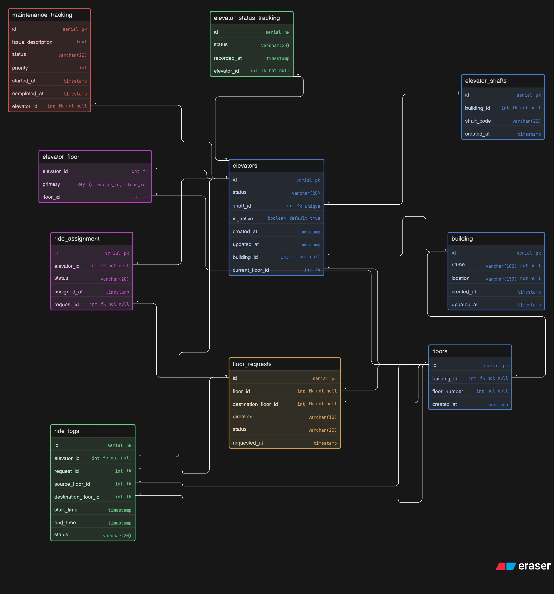

# Smart-Elevator-Control

---

# Mental Map

### 1. Passenger Creates Request

The passenger selects a pickup floor and destination floor.

The system stores the request in `floor_requests`.

Stored data:

- pickup floor
- destination floor
- direction (up / down)
- requested time
- status = pending

---

### 2. System Identifies Building

Each floor belongs to a building.

Using:

- `floors.building_id`

The system determines which building the request belongs to.

---

### 3. Find Eligible Elevators

The system checks available elevators using:

- `elevators`
- `elevator_floor`

Conditions:

- elevator belongs to same building
- `is_active = true`
- not under maintenance
- elevator can stop at pickup floor
- elevator can stop at destination floor

---

### 4. Smart Dispatch Logic

The best elevator is selected based on:

- nearest elevator
- current direction
- idle elevators first
- shortest waiting time
- load balancing

---

### 5. Assign Elevator

The system creates a record in `ride_assignment`.

Stored data:

- request_id
- elevator_id
- assigned_at
- status = assigned

---

### 6. Elevator Moves to Passenger

Update elevator state:

- status = moving
- current floor changes

Track history inside:

- `elevator_status_tracking`

---

### 7. Passenger Enters Elevator

Trip starts.

Create row in `ride_logs`.

Stored data:

- elevator_id
- request_id
- source_floor_id
- destination_floor_id
- start_time
- status = active

---

### 8. Passenger Reaches Destination

Update ride log:

- end_time = now
- status = completed

Update request:

- status = completed

Update elevator:

- status = idle

---

# While Elevator Is Running

Live system state is stored using:

## Current Position

- `elevators.current_floor_id`

## Current Status

- `elevators.status`

Examples:

- idle
- moving
- maintenance

## History Tracking

- `elevator_status_tracking`

---

# Maintenance Flow

## 1. Issue Reported

Create row in `maintenance_tracking`.

Stored data:

- elevator_id
- issue_description
- priority
- status = scheduled

---

## 2. Technician Starts Work

Update maintenance:

- status = in_progress
- started_at = now

Update elevator:

- status = maintenance
- is_active = false

---

## 3. Maintenance Completed

Update maintenance:

- completed_at = now
- status = completed

Update elevator:

- status = idle
- is_active = true

---

# Real Example

Passenger at Floor 7 wants to go to Floor 18.

Flow:

1. Request created
2. System checks elevators that serve floors 7 and 18
3. Elevator B is nearest
4. Elevator B gets assigned
5. Elevator moves to floor 7
6. Passenger enters
7. Elevator reaches floor 18
8. Ride marked completed

---

# Key Tables

- `building`
- `floors`
- `elevator_shafts`
- `elevators`
- `elevator_floor`
- `floor_requests`
- `ride_assignment`
- `ride_logs`
- `elevator_status_tracking`
- `maintenance_tracking`

---
